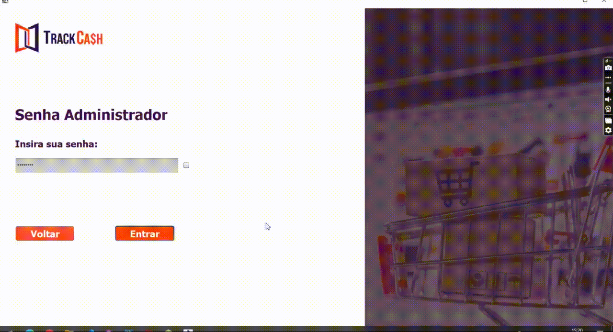
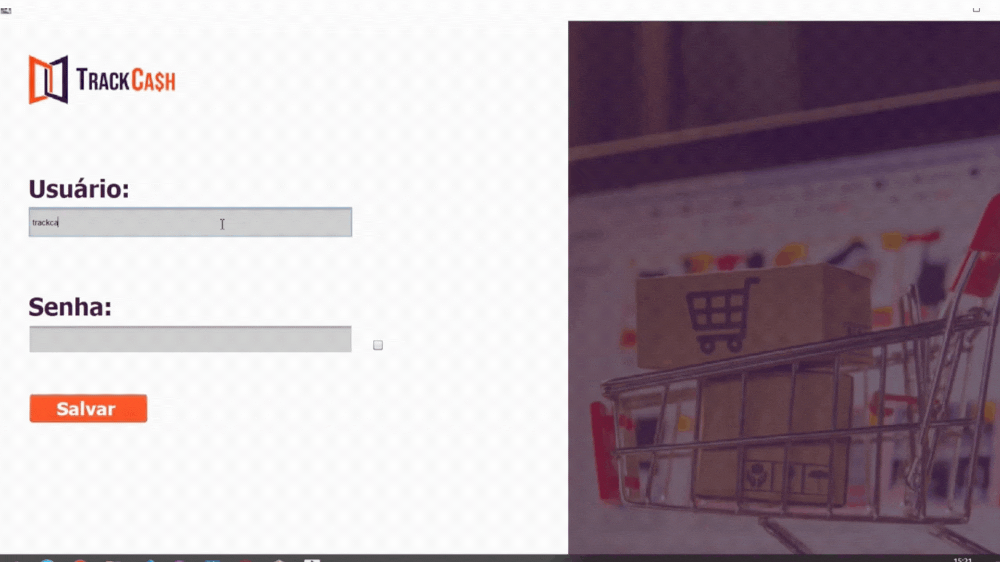
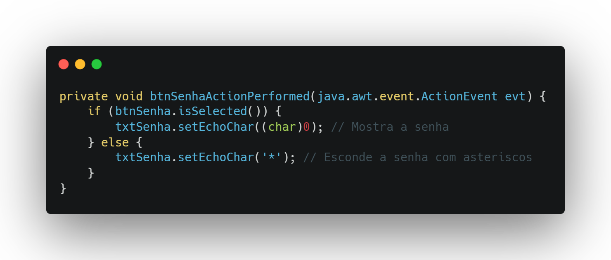
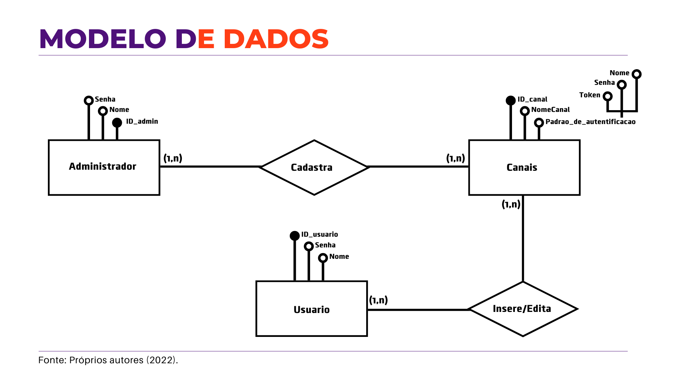
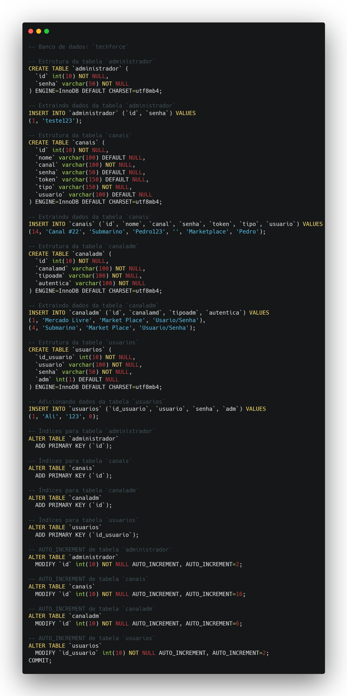

  

<h2 align="center">Ali Mohamed Khodr</h2>

  
  
  

| 🎓 Curso | 📚 Modalidade | 👨‍🏫 Orientador |
| :---: | :---: | :---: |
| Tecnólogo em Banco de Dados | Portfólio de Aprendizagem de Projetos Integradores (API) | Prof. Giuliano Bertoti |

---

## 👋 Sobre mim

Meu nome é Ali Mohamed Khodr, sou desenvolvedor full stack e estudante do 6º semestre de <b>Banco de Dados</b> na FATEC de São José dos Campos – Prof. Jessen Vidal. Antes da faculdade, me formei como Técnico em Desenvolvimento de Sistemas pela ETEC de São José dos Campos, onde tive meu primeiro contato com programação e com banco de dados.

Comecei a FATEC no curso de Análise e Desenvolvimento de Sistemas (ADS), onde participei dos dois primeiros Projetos Integradores, e depois segui para Banco de Dados, onde realizei os demais. Cada semestre trouxe uma empresa parceira, um problema real e uma stack diferente. Foi nesses projetos que passei de páginas estáticas em HTML para aplicações com frontend, backend, ETL, testes automatizados e integração contínua.

Profissionalmente, atuo como desenvolvedor full stack no Qeevo Group (Quero Educação), trabalhando com Vue.js e Nuxt no frontend, Ruby, Elixir e Node.js no backend e PostgreSQL como banco de dados principal, além de serviços da AWS. Antes disso, estagiei na APTIV (unidade de Jambeiro), multinacional do setor automotivo, desenvolvendo aplicações em ASP.NET Web Forms (VB.NET e C#), sistemas desktop em Windows Forms e rotinas em SQL Server.

## 🧠 Meus principais conhecimentos

   
   
   

---

## 🗂️ Projetos

<table align="center">
  <tr>
    <td align="center" width="33%"><a href="#api-1"><b>1º Semestre · 2022/1</b> DispVag FATEC (interno)</a></td>
    <td align="center" width="33%"><a href="#api-2"><b>2º Semestre · 2022/2</b> TrackCash TrackCash</a></td>
    <td align="center" width="33%"><a href="#api-3"><b>3º Semestre · 2024/1</b> DrConvert Dom Rock</a></td>
  </tr>
  <tr>
    <td align="center"><a href="#api-4"><b>4º Semestre · 2024/2</b> GeoTrack ITO1</a></td>
    <td align="center"><a href="#api-5"><b>5º Semestre · 2025/1</b> Track Youtan</a></td>
    <td align="center"><a href="#api-6"><b>6º Semestre · 2025/2</b> VisionData Pro4tech</a></td>
  </tr>
</table>

Clique em <b>VER MAIS DETALHES</b> em cada projeto para abrir o problema, a solução, as tecnologias, as minhas contribuições e as skills desenvolvidas.

 

<!-- ============================== API 1 ============================== -->

<h1 align="center">DispVag · 1º Semestre 2022/1</h1>

  Empresa Parceira · <a href="https://fatecsjc-prd.azurewebsites.net/">FATEC São José dos Campos (interno)</a> 
  Professores · Jean Carlos Costa (M2) e Antônio Egydio (P2) · Curso de ADS · Equipe TechForce

  

  

<b>VER MAIS DETALHES</b>

<h2>Área de atuação</h2>

A FATEC São José dos Campos é uma instituição pública de ensino superior tecnológico, mantida pelo Centro Paula Souza. Neste projeto, a própria coordenação atuou como cliente, com foco em apoiar alunos e profissionais da área de tecnologia na busca por oportunidades.

<h2>Problema</h2>

Os alunos tinham dificuldade para encontrar vagas adequadas ao seu perfil, principalmente na área de TI. As oportunidades estavam espalhadas por várias plataformas, sem organização, e não havia uma forma de relacionar as competências pedidas pelo mercado com os cursos e certificações disponíveis.

<h2>Solução</h2>

O DispVag é um sistema web que cataloga vagas de emprego com ênfase em TI, separando-as por área (Front-end, Back-end e Outros) e apresentando para cada vaga os requisitos, a área profissional, os benefícios e as informações da empresa contratante. O site foi estruturado nas cinco páginas exigidas pela FATEC: página principal, vagas de emprego, cursos e certificações, métricas e localização.

<b>🖥️ Telas do sistema</b>

 

<b>Busca de vagas por área</b>

<b>Vagas de Front-end</b>

<b>Detalhes da vaga</b>

<b>Informações da empresa</b>

<h2>Tecnologias Utilizadas no Projeto</h2>

<strong>Python:</strong> linguagem exigida pela FATEC para o desenvolvimento do projeto.

<strong>HTML5 e CSS3:</strong> estruturação e estilização das páginas do site.

<strong>Bootstrap:</strong> framework utilizado para deixar o layout responsivo e padronizado.

<strong>Canva:</strong> criação dos protótipos e das apresentações das sprints.

<strong>Git e GitHub:</strong> versionamento e documentação do projeto.

<strong>Discord:</strong> comunicação da equipe e reuniões de sprint.

<h2>Minhas Contribuições</h2>

Este foi meu primeiro projeto real em equipe e meu primeiro contato com o Scrum. Atuei como parte do Scrum Team no desenvolvimento das páginas em HTML, CSS e Bootstrap, em especial as listagens de vagas por área e as páginas de detalhes da vaga e da empresa, cuidando da responsividade e do padrão visual entre as páginas. Também participei do levantamento de requisitos com o cliente e da documentação exigida na disciplina (wireframes, Design Thinking e Balanced Scorecard).

Os commits foram feitos pela conta compartilhada da equipe (<code>TechForce-ADS</code>), por isso não há histórico individual no repositório.

<h2>Hard Skills</h2>

Exercitei algumas hard skills durante esse projeto:
- HTML e CSS - Sei fazer sozinho
- Bootstrap - Sei fazer sozinho
- Python - Sei fazer com ajuda
- Git e GitHub - Sei fazer com ajuda
- Scrum - Sei fazer com ajuda

<h2>Soft Skills</h2>

| Soft Skill | Onde foi aplicada |
| :--- | :--- |
| Trabalho em equipe | Primeiro projeto com sete integrantes. Aprendi a dividir as páginas entre os membros e a combinar um padrão visual para que o site parecesse feito por uma só pessoa. |
| Comunicação | Participei das reuniões com o cliente e das apresentações de fim de sprint, explicando o que tinha sido desenvolvido e ouvindo os ajustes pedidos. |
| Proatividade | Como Git e Bootstrap eram novidade para a maior parte da equipe, estudei por conta própria e ajudei os colegas a resolverem conflitos e a organizar o layout. |

<h2>Link do repositório no GitHub</h2>

<a href="https://github.com/TechForce-ADS/DispVag">TechForce-ADS/DispVag</a>

  

<!-- ============================== API 2 ============================== -->

<h1 align="center">TrackCash · 2º Semestre 2022/2</h1>

  Empresa Parceira · <a href="https://www.trackcash.com.br/">TrackCash</a> 
  Professores · Cláudio Etelvino de Lima (M2) e Giuliano Bertoti (P2) · Curso de ADS · Equipe TechForce

  

  

<b>VER MAIS DETALHES</b>

<h2>Área de atuação</h2>

A TrackCash é uma solução B2B de conciliação de vendas e pagamentos. A plataforma reúne em um único painel os dados de e-commerces, marketplaces e lojas físicas, dando às empresas uma visão clara e estratégica das suas finanças.

<h2>Problema</h2>

Os clientes da TrackCash (lojistas online e físicos) usavam vários canais de venda e precisavam autorizar o acesso aos dados de cada um deles para que a conciliação financeira fosse feita. Sem uma interface dedicada, esse processo de autorização era lento, descentralizado e sujeito a erros.

<h2>Solução</h2>

Desenvolvemos uma aplicação desktop em que o lojista cadastra e configura seus canais de venda e meios de pagamento, informando as credenciais (e-mail/senha ou tokens) que permitem à TrackCash acessar os dados. A aplicação tem cadastro de canais, visualização e pesquisa com filtros, configuração de canais pelo cliente e edição e exclusão de configurações, restritas ao administrador.

<h2>Tecnologias Utilizadas no Projeto</h2>

<strong>Java:</strong> linguagem utilizada no desenvolvimento da aplicação desktop (requisito da FATEC).

<strong>MySQL:</strong> SGBD relacional utilizado para armazenar usuários, administradores e canais.

<strong>NetBeans:</strong> IDE utilizada, incluindo o GUI Builder para a construção das telas.

<strong>Canva:</strong> prototipação das telas e criação das apresentações.

<strong>Git e GitHub:</strong> versionamento e documentação do projeto.

<h2>Minhas Contribuições</h2>

Fiquei responsável pela prototipação e construção das telas da aplicação, o que me fez avançar bastante em UX/UI. Também elaborei o modelo de dados e criei o banco MySQL, meu primeiro contato com modelagem relacional em um projeto real.

<b>🖥️ Interface gráfica da aplicação</b>

 

Toda a interface foi construída com o GUI Builder do NetBeans. Criei e alinhei campos de texto, combos, botões, painéis e logos, padronizando as cores e mantendo a coerência visual entre as telas.

<b>👁️ Exibir e ocultar senha</b>

 

Funcionalidade que alterna a visibilidade da senha para o usuário conferir o que está digitando.

<b>🗂️ Modelo de dados</b>

 

Modelo criado antes do banco, definindo as entidades de administrador, usuário e canais e os relacionamentos entre elas.

<b>🐬 Banco de dados MySQL</b>

 

Script de criação das tabelas de administrador, canais, canais do administrador e usuários, com as chaves primárias e estrangeiras.

Os commits foram feitos pela conta compartilhada da equipe (<code>TechForce-ADS</code>), por isso não há histórico individual no repositório.

<h2>Hard Skills</h2>

Exercitei algumas hard skills durante esse projeto:
- Java (Swing / NetBeans) - Sei fazer sozinho
- Modelagem de banco de dados - Sei fazer sozinho
- MySQL - Sei fazer com ajuda
- UX/UI e prototipação - Sei fazer sozinho
- Scrum - Sei fazer sozinho

<h2>Soft Skills</h2>

| Soft Skill | Onde foi aplicada |
| :--- | :--- |
| Organização e planejamento | Dividi a construção das telas por sprint para que o CRUD completo, com a página de administrador, ficasse pronto até a Sprint 4. |
| Comunicação assertiva | Alinhei com o cliente o fluxo de cadastro e configuração dos canais antes de construir as telas, evitando retrabalho. |
| Resiliência | Após o feedback de uma sprint, precisei refazer as tabelas de administrador e usuário e ajustar as telas que dependiam delas. |

<h2>Link do repositório no GitHub</h2>

<a href="https://github.com/TechForce-ADS/TrackCash">TechForce-ADS/TrackCash</a>

  

<!-- ============================== API 3 ============================== -->

<h1 align="center">DrConvert · 3º Semestre 2024/1</h1>

  Empresa Parceira · <a href="https://www.domrock.net/">Dom Rock</a> 
  Curso de Banco de Dados · Equipe Void

  

  

<b>VER MAIS DETALHES</b>

<h2>Área de atuação</h2>

A Dom Rock atua no setor de Tecnologia da Informação com soluções de Inteligência Artificial e análise avançada de dados. Sua plataforma integra e processa grandes volumes de dados para gerar insights estratégicos, automatizar processos e apoiar decisões, com clientes do setor privado e público.

<h2>Problema</h2>

A Dom Rock processa dados em uma pipeline de vários estágios (Landing Zone, Bronze e Silver). Para a plataforma funcionar, as fontes de dados de cada cliente precisam ser configuradas manualmente, tarefa que consome muito tempo e cria dependência de técnicos especializados.

<h2>Solução</h2>

O DrConvert é uma plataforma web de mapeamento e conversão de dados em que o próprio usuário configura cada estágio: faz o upload do arquivo <code>.csv</code>, visualiza e ajusta os campos e tipos detectados, define o campo identificador, classifica os campos e cria regras de conversão "de → para". A plataforma também tem um dashboard administrativo e gera um arquivo <code>.yaml</code> com o esquema dos dados.

<b>🎨 Protótipos das telas (Figma)</b>

 

<b>Login</b>

<b>Meus projetos</b>

<b>Upload de arquivo</b>

<b>Página do projeto</b>

<b>🗃️ Modelagem do banco de dados</b>

 

<b>Modelo entidade-relacionamento</b>

<b>Modelo lógico</b>

<h2>Tecnologias Utilizadas no Projeto</h2>

<strong>Next.js e React:</strong> framework e biblioteca utilizados no desenvolvimento do frontend.

<strong>TypeScript:</strong> tipagem estática no frontend.

<strong>Tailwind CSS:</strong> estilização utilitária das telas.

<strong>Java e Spring Boot:</strong> desenvolvimento da API REST no backend.

<strong>MySQL:</strong> SGBD relacional utilizado para armazenar projetos, arquivos, campos e classificações.

<strong>Figma:</strong> prototipação das telas em alta fidelidade.

<h2>Minhas Contribuições</h2>

Atuei no frontend em Next.js, principalmente na página do projeto, onde o usuário acompanha e configura os estágios do mapeamento. Foi meu primeiro contato com React e com os conceitos de pipeline de dados.

<b>📄 Página do projeto e navegação entre estágios</b>

 

Criei a página do projeto (<code>project/page.tsx</code>) com o controle de navegação entre os estágios Landing Zone, Bronze e Silver (<code>page-control.tsx</code>) e os cards dos campos mapeados (<code>field-card.tsx</code>). Depois refatorei essa página para acompanhar as novas rotas e componentes da aplicação.

<b>📤 Opção "arquivo possui cabeçalho" no upload</b>

 

No formulário de upload (<code>upload-form.tsx</code>), adicionei a opção de informar se o CSV tem linha de cabeçalho e passei a enviar essa informação ao serviço de upload, para que o backend identifique corretamente os nomes dos campos.

<h2>Hard Skills</h2>

Exercitei algumas hard skills durante esse projeto:
- React / Next.js - Sei fazer com ajuda
- TypeScript - Sei fazer com ajuda
- Tailwind CSS - Sei fazer sozinho
- Consumo de API REST - Sei fazer sozinho
- Pipeline de dados (Landing Zone, Bronze e Silver) - Sei fazer com ajuda

<h2>Soft Skills</h2>

| Soft Skill | Onde foi aplicada |
| :--- | :--- |
| Adaptabilidade | Entrei em uma equipe nova e em uma stack que eu ainda não conhecia (React e Next.js), e precisei entregar funcionalidades já na primeira sprint. |
| Trabalho em equipe | Integrei minhas telas às rotas que os colegas criavam no backend, combinando com eles os formatos de requisição e resposta. |
| Aprendizado contínuo | Estudei React e os conceitos de pipeline de dados em paralelo às sprints para acompanhar o ritmo da equipe. |

<h2>Link do repositório no GitHub</h2>

<a href="https://github.com/alimkhodr/Projeto-API-Drconvert">Projeto-API-Drconvert</a> · <a href="https://github.com/alimkhodr/Projeto-API-Drconvert/commits?author=alimkhodr">meus commits</a>

  

<!-- ============================== API 4 ============================== -->

<h1 align="center">GeoTrack · 4º Semestre 2024/2</h1>

  Empresa Parceira · <a href="https://www.linkedin.com/company/ito1/">ITO1</a> 
  Curso de Banco de Dados · Equipe iNineBD

  

   

<b>VER MAIS DETALHES</b>

<h2>Área de atuação</h2>

A ITO1 desenvolve soluções e gerencia infraestrutura de TI, incluindo suporte técnico (Service Desk e Field Services) e fornecimento de equipamentos em larga escala. Também aplica IoT, Smart Cities, Indústria 4.0, IA e Big Data para apoiar a transformação digital de organizações públicas e privadas.

<h2>Problema</h2>

A empresa precisava armazenar e consultar em tempo real os dados de geolocalização gerados continuamente por dispositivos IoT, como wearables, tags e smartphones, usados no monitoramento de pessoas e ativos. O volume de dados exigia um sistema escalável, confiável e seguro, que não dependesse de técnicos especializados.

<h2>Solução</h2>

O GeoTrack é um sistema web de rastreamento em mapa. Ele mostra os pontos de parada de cada dispositivo, filtra por pessoa, dispositivo e período (com atalhos como "Hoje" e "Últimos 3 dias"), permite criar áreas geográficas para descobrir quem passou por elas, traça as rotas percorridas e gera relatórios, tudo com login e modo escuro.

<b>🎬 Demonstrações do sistema</b>

 

<b>Pontos de parada</b>

https://github.com/user-attachments/assets/4128487b-0f7e-4f38-b1b4-d9d4b1c8c134

<b>Sessões geográficas</b>

https://github.com/user-attachments/assets/b579fb93-4def-4e32-a488-bc8f52f933be

<b>Login e cadastro</b>

https://github.com/user-attachments/assets/05a58f73-cfc3-4bf2-9a53-5933d493bd7f

<b>Relatórios</b>

https://github.com/user-attachments/assets/0564a780-80b7-4986-8577-b29f1c2aff6e

<b>Modo escuro</b>

https://github.com/user-attachments/assets/5b43a7f7-bac8-477c-847d-13c51ed2d0e1

<b>🗃️ Modelagem do banco de dados</b>

 

<h2>Tecnologias Utilizadas no Projeto</h2>

<strong>Vue.js 3 e Vite:</strong> framework e ferramenta de build utilizados no frontend.

<strong>Vuetify:</strong> biblioteca de componentes de UI utilizada nas telas.

<strong>Google Maps API:</strong> renderização do mapa, marcadores, áreas, rotas e Street View.

<strong>Java e Spring Boot:</strong> desenvolvimento da API REST no backend.

<strong>Oracle:</strong> banco de dados que armazena as geolocalizações dos dispositivos.

<strong>Docker:</strong> conteinerização dos serviços da aplicação.

<h2>Minhas Contribuições</h2>

Entrei na equipe iNineBD neste semestre e fui um dos principais desenvolvedores do frontend, da estrutura inicial do projeto até as funcionalidades do mapa. Foram 26 commits no repositório do frontend.

<b>🏗️ Estrutura do projeto e configuração do mapa</b>

 

Montei a estrutura do frontend com Vue 3, Vite e Vuetify, configurei o Google Maps (incluindo as tipagens <code>google.maps.d.ts</code>) e criei o layout com menu lateral (<code>Sidebar.vue</code>), adaptado para telas menores.

<b>📍 Marcadores de usuários e filtros de busca</b>

 

Criei o componente de marcadores com avatar, que plota no mapa os dados vindos do banco. Implementei os filtros por usuário, dispositivo e período: o botão de consulta só é habilitado com todos os campos preenchidos, e o botão "Limpar" permite trocar de usuário. Também participei dos filtros rápidos e da seleção de múltiplos usuários, e corrigi a inicialização do mapa e os pontos de parada.

<b>🗺️ Áreas geográficas</b>

 

Trabalhei no filtro de áreas geográficas, atualizando a listagem após salvar ou excluir uma área e sincronizando o modal quando o usuário troca de área. Adicionei <i>loading</i> nos botões, <i>snackbar</i> de erro e a limpeza dos marcadores.

<b>🛣️ Rotas e Street View</b>

 

Criei o componente <code>GeoRoutesFilter</code>, que busca e traça no mapa as rotas percorridas por um usuário, e ajustei o posicionamento da localização no Street View.

https://github.com/user-attachments/assets/c8cac9f0-a0e4-436a-a127-563b083f6042

<h2>Hard Skills</h2>

Exercitei algumas hard skills durante esse projeto:
- Vue.js 3 - Sei fazer sozinho
- Vuetify - Sei fazer sozinho
- Google Maps API - Sei fazer sozinho
- Dados geoespaciais (pontos, áreas e rotas) - Sei fazer com ajuda
- Git flow com Pull Requests - Sei fazer sozinho

<h2>Soft Skills</h2>

| Soft Skill | Onde foi aplicada |
| :--- | :--- |
| Adaptabilidade | Entrei em uma equipe que já trabalhava junta havia três semestres e, logo na primeira sprint, assumi a reestruturação do frontend. |
| Proatividade | Corrigi problemas na inicialização do mapa e nos pontos de parada que estavam travando as tarefas de outros colegas. |
| Colaboração | Trabalhei junto do time de backend para definir como os dados de geolocalização do Oracle chegariam ao mapa, ajustando consultas e filtros. |

<h2>Link do repositório no GitHub</h2>

<a href="https://github.com/iNineBD/GeoTrack-4Sem2024Main">GeoTrack-4Sem2024Main</a> · <a href="https://github.com/iNineBD/GeoTrack-4Sem2024/commits?author=alimkhodr">meus commits</a>

  

<!-- ============================== API 5 ============================== -->

<h1 align="center">Track · 5º Semestre 2025/1</h1>

  Empresa Parceira · <a href="https://youtan.com.br/">Youtan</a> 
  Curso de Banco de Dados · Equipe iNineBD

  

  

<b>VER MAIS DETALHES</b>

<h2>Área de atuação</h2>

A Youtan desenvolve soluções digitais sob medida: sistemas, softwares web e aplicativos mobile híbridos, Android e iOS. Seus projetos buscam melhorar processos, aumentar a produtividade e dar mais autonomia aos clientes, priorizando experiência e usabilidade.

<h2>Problema</h2>

A Youtan gerenciava seus projetos em ferramentas como Taiga e Jira, mas não tinha um painel centralizado com indicadores de fluxo, como tempo médio de conclusão, volume de tarefas por período e distribuição entre colaboradores. Além disso, o Taiga não oferecia níveis de acesso diferentes para operadores, gerentes e administradores.

<h2>Solução</h2>

O Track é uma plataforma integrada às bases do Taiga e do Jira. Um ETL em Python alimenta um Data Warehouse em PostgreSQL, uma API em Go expõe os indicadores e um frontend em Nuxt os apresenta em dashboards interativos: cards criados, iniciados e concluídos, tempo médio de execução e retrabalho, com visualização por tag, colaborador e status. Cada perfil (Operador, Gerente e Administrador) vê apenas as informações do seu escopo.

<b>🎬 Evolução dos dashboards por sprint</b>

 

<b>Sprint 1 · Painéis iniciais com métricas por tag, colaborador e status</b>

https://github.com/user-attachments/assets/e50179a1-2833-4d28-a591-717038dda2ae

<b>Sprint 2 · Controle de acesso e novos indicadores</b>

https://github.com/user-attachments/assets/4bb407cb-d21c-451a-a7cf-86028c98c0e4

<b>Sprint 3 · Filtros avançados e integração com o Jira</b>

https://github.com/user-attachments/assets/4079aa37-ad77-4b16-9e65-9312248a8ba6

<b>🗃️ Modelagem do Data Warehouse</b>

 

<h2>Tecnologias Utilizadas no Projeto</h2>

<strong>Nuxt 3, Vue.js e TypeScript:</strong> desenvolvimento do frontend.

<strong>Nuxt UI e Tailwind CSS:</strong> componentes e estilização das telas.

<strong>Pinia:</strong> gerenciamento de estado, com persistência da sessão do usuário.

<strong>Chart.js:</strong> construção dos gráficos dos dashboards.

<strong>Vitest:</strong> testes unitários dos componentes do frontend.

<strong>Go:</strong> desenvolvimento da API REST no backend.

<strong>PostgreSQL:</strong> banco de dados e Data Warehouse com os indicadores.

<strong>SQLite:</strong> banco em memória usado nos testes de integração do backend.

<strong>Python:</strong> ETL que extrai os dados do Taiga e do Jira e carrega o Data Warehouse.

<strong>GitHub Actions e SonarQube:</strong> integração contínua com lint, testes e análise de qualidade.

<h2>Minhas Contribuições</h2>

Fui o principal responsável pelo frontend, com 81 commits no repositório: criei o projeto, defini a estrutura e os padrões seguidos pela equipe e desenvolvi os dashboards, a autenticação e a gestão de usuários. No backend, escrevi os testes de integração do login.

<b>🏗️ Setup inicial, qualidade e CI</b>

 

Criei o projeto em Nuxt 3 com Nuxt UI, o header e o footer com alternância de tema e os componentes base. Configurei o ESLint e o workflow de CI para rodar lint e testes antes do build, e escrevi testes unitários com Vitest para os componentes de gráficos.

<b>📊 Dashboards e métricas</b>

 

Desenvolvi os componentes de gráficos com Chart.js (rosca, barras verticais e horizontais) e os cards de estatística. Criei os filtros de projeto, de plataforma (Taiga ou Jira) e de período (<code>v-calendar</code> + <code>date-fns</code>), consumindo as estatísticas do backend com <i>skeleton loading</i> e tratamento de erro. O dashboard evoluiu de uma tela de listagem de projetos para um painel único com filtros.

https://github.com/user-attachments/assets/ff5541c3-491b-4837-ae91-4bc8169d5d21

<b>🔐 Primeiro acesso, definir senha e login</b>

 

Implementei o fluxo de primeiro acesso, com validação do e-mail e envio de token, a tela de definir senha e o login. A sessão é controlada por middleware de autenticação, por uma store do usuário em Pinia com estado persistido e por um interceptor do Axios que trata respostas <code>401</code>.

<b>👥 Gestão de usuários e perfis</b>

 

Criei a página de usuários, acessível apenas a administradores (middleware <code>admin</code>), com listagem paginada e alteração de perfil por meio dos composables <code>useUsers</code>, <code>useRoles</code> e <code>useUpdateRole</code>.

<b>🧪 Testes de integração no backend (Go)</b>

 

Escrevi os testes de integração do controller de login em Go, usando SQLite em memória para validar a integração entre a API e o banco sem depender do PostgreSQL.

<h2>Hard Skills</h2>

Exercitei algumas hard skills durante esse projeto:
- Nuxt 3 / Vue.js - Sei ensinar
- Nuxt UI / Tailwind CSS - Sei ensinar
- Pinia e autenticação no frontend - Sei fazer sozinho
- Visualização de dados com Chart.js - Sei fazer sozinho
- Testes com Vitest e testes de integração em Go - Sei fazer sozinho
- CI com GitHub Actions - Sei fazer com ajuda
- Modelagem de Data Warehouse - Sei fazer com ajuda

<h2>Soft Skills</h2>

| Soft Skill | Onde foi aplicada |
| :--- | :--- |
| Liderança técnica | Como responsável pelo frontend, defini a estrutura de pastas, os componentes base e os padrões de lint que o restante da equipe passou a seguir. |
| Proatividade | Quando o cliente pediu um fluxo mais direto, propus e fiz a refatoração do dashboard, trocando a tela de listagem de projetos por um painel único com filtros. |
| Organização | Vinculei os commits às tarefas do Jira (<code>TRK-94</code>, <code>TRK-135</code>...), o que facilitou a rastreabilidade das entregas em cada sprint. |
| Comunicação | Alinhei com o time de backend os contratos das rotas de estatísticas e de usuários antes de implementar as telas. |

<h2>Link do repositório no GitHub</h2>

<a href="https://github.com/iNineBD/Track-5Sem2025Main">Track-5Sem2025Main</a> · <a href="https://github.com/iNineBD/Track-5Sem2025Front/commits?author=alimkhodr">meus commits (front)</a> · <a href="https://github.com/iNineBD/Track-5Sem2025Server/commits?author=alimkhodr">meus commits (back)</a>

  

<!-- ============================== API 6 ============================== -->

<h1 align="center">VisionData · 6º Semestre 2025/2</h1>

  Empresa Parceira · <a href="https://www.pro4tech.com.br/">Pro4tech</a> 
  Curso de Banco de Dados · Equipe iNineBD

  

   

<b>VER MAIS DETALHES</b>

<h2>Área de atuação</h2>

A Pro4tech é especializada em transformação digital. Usa tecnologias como inteligência artificial, análise de dados, IoT e computação em nuvem para criar estratégias personalizadas que aumentam a eficiência, melhoram a experiência do cliente e impulsionam o crescimento dos negócios.

<h2>Problema</h2>

A Pro4tech tinha um grande volume de chamados de suporte antigos e desorganizados. Sem estrutura, a equipe perdia tempo procurando soluções para problemas já resolvidos, e a empresa não conseguia extrair insights estratégicos desse histórico.

<h2>Solução</h2>

O VisionData transforma os chamados em uma base de conhecimento pesquisável. O sistema oferece busca vetorizada de chamados semelhantes, dashboards de métricas quantitativas e qualitativas, previsões por produto ou cliente com modelos de Machine Learning e exportação de insights gerados por IA. Tudo foi construído seguindo a LGPD, com anonimização, logs de auditoria, backups, controle de consentimento e perfis de acesso.

<b>🎬 Demonstrações do sistema</b>

 

<b>Busca vetorizada de chamados</b>

https://github.com/user-attachments/assets/30d9abb9-9cf5-449f-801c-5940ac5bfc88

<b>Dashboards</b>

https://github.com/user-attachments/assets/2fe0d586-2ed8-46ab-819e-6bd512c24b1f

<b>Algoritmos de predição</b>

https://github.com/user-attachments/assets/29441974-da67-4a34-9b76-0d0839affb54

<b>Exportação de insights da IA</b>

https://github.com/user-attachments/assets/4eb3a23a-2c3c-439c-98e6-10afd77fc0e6

<b>🗃️ Modelagem do Data Warehouse</b>

 

<h2>Tecnologias Utilizadas no Projeto</h2>

<strong>Nuxt, Vue.js e TypeScript:</strong> desenvolvimento do frontend, incluindo as rotas de servidor do Nuxt.

<strong>nuxt-auth-utils:</strong> gerenciamento de sessão e autenticação, incluindo o login com conta Microsoft.

<strong>Chart.js:</strong> gráficos dos dashboards.

<strong>Go:</strong> desenvolvimento da API REST no backend.

<strong>Elasticsearch:</strong> indexação e busca vetorizada dos chamados.

<strong>Oracle:</strong> banco relacional e Data Warehouse do projeto.

<strong>Python:</strong> ETL e modelos de Machine Learning para as previsões.

<strong>Jira:</strong> gestão das sprints e das tarefas da equipe.

<h2>Minhas Contribuições</h2>

Fiquei responsável pela autenticação e pela gestão de usuários no frontend, que sustentam os requisitos de segurança e de LGPD do projeto.

<b>🔐 Fluxo de autenticação</b>

 

Configurei o módulo <code>nuxt-auth-utils</code> e implementei login, logout e sessão do usuário, incluindo as rotas de servidor do Nuxt (<code>login</code>, <code>logout</code> e <code>user</code>), o composable <code>useAuth</code> e os middlewares <code>authenticated</code> e <code>admin</code>.

<b>🪟 Login com conta Microsoft</b>

 

Implementei o login com conta Microsoft: a rota de servidor <code>login/microsoft</code>, o botão na tela de login e uma página de retorno que dá feedback ao usuário depois da autenticação.

https://github.com/user-attachments/assets/e2f8fa48-4e8c-4522-89bc-fc8b09cc7e53

<b>👥 Gestão de usuários e perfil</b>

 

Criei a página de gestão de usuários (listagem, edição e exclusão, com modais de criação e exclusão) e a página de perfil, onde o usuário altera a senha ou exclui a própria conta, atendendo ao direito de eliminação de dados previsto na LGPD.

https://github.com/user-attachments/assets/fa42cba7-e5b6-4933-9885-ef0a5ef433c9

https://github.com/user-attachments/assets/80777b11-bee5-4fff-98e2-21b0d2a71532

<h2>Hard Skills</h2>

Exercitei algumas hard skills durante esse projeto:
- Nuxt (rotas de servidor e middlewares) - Sei ensinar
- Autenticação e sessão (nuxt-auth-utils e OAuth Microsoft) - Sei fazer sozinho
- Controle de acesso por perfil (RBAC) - Sei fazer sozinho
- LGPD aplicada a sistemas - Sei fazer com ajuda
- Elasticsearch - Sei fazer com ajuda

<h2>Soft Skills</h2>

| Soft Skill | Onde foi aplicada |
| :--- | :--- |
| Senso de responsabilidade | Assumi a parte de segurança e acesso, que era crítica para cumprir os requisitos de LGPD, e garanti que as páginas restritas ficassem protegidas pelos middlewares. |
| Gestão de tempo | Conciliei o trabalho em tempo integral com as entregas das sprints, concentrando as tarefas maiores (login Microsoft e gestão de usuários) nos períodos com mais disponibilidade. |
| Comunicação | Alinhei com os times de backend e de ML os contratos de autenticação e os perfis de acesso para que cada tela mostrasse só o que o usuário podia ver. |

<h2>Link do repositório no GitHub</h2>

<a href="https://github.com/iNineBD/VisionData-6Sem2025Main">VisionData-6Sem2025Main</a> · <a href="https://github.com/iNineBD/VisionData-6Sem2025Front/commits?author=alimkhodr">meus commits</a>

  

---

## 🎯 Considerações finais

Os seis Projetos Integradores mostram uma evolução clara. Comecei construindo páginas estáticas e telas desktop, passei pela modelagem relacional com MySQL e cheguei a aplicações completas, com frontend em Nuxt, backends em Java e Go, bancos Oracle e PostgreSQL, Data Warehouses, pipelines de ETL, testes automatizados, CI e requisitos de segurança e LGPD. Ao longo desse caminho, também deixei de ser quem está aprendendo a stack para ser quem define a estrutura do frontend e os padrões seguidos pela equipe.

